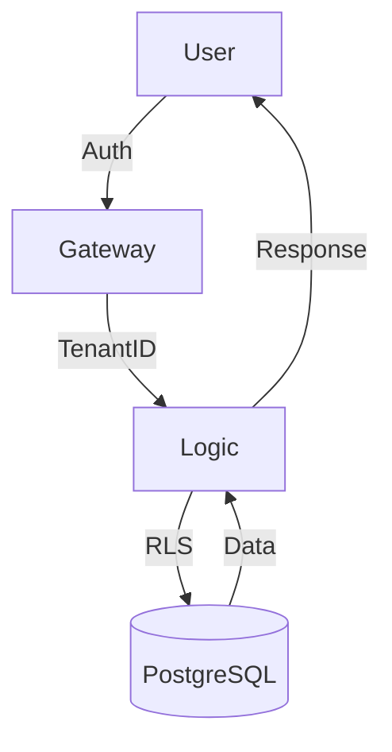

# Technical Deep Dive

Building **Heimdall** required a robust approach to multitenancy. We chose Rust for its memory safety and performance characteristics.

## Multitenancy Model

We use a **Bridge approach** where tenants share the same database but occupy distinct logical schemas.

### Mermaid Diagram Example

## Mathematical Modeling

The performance of our concurrent tenant isolations can be modeled by the following equation:

$$ P_{tenant} = \frac{R_{total} - \sum_{i=1}^{n} L_i}{C_{overhead}} $$

Where $L_i$ represents the latency of the $i$-th tenant request.

## Tech Stack Overview

| Layer | Technology | Role |
| :--- | :--- | :--- |
| Backend | Rust | Core Logic |
| Frontend | React | Dashboard |
| Infrastructure | AWS | Scaling |

## Summary

This architecture allows us to scale to thousands of tenants with minimal overhead.
